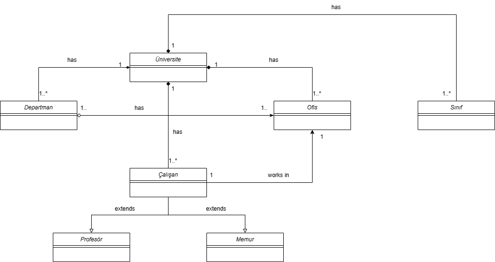

# Patika OOP Ödev 1 — Üniversite Sistemi UML Sınıf Diyagramı

Bu repo, nesne yönelimli programlama (OOP) dersi kapsamında verilen birinci ödev için hazırlanmış UML sınıf diyagramını içermektedir.

## Görev

Aşağıdaki gereksinimleri karşılayan bir UML Sınıf Diyagramı çizilmesi istenmiştir:

1. Üniversiteye ait sınıflıklar, çalışma ofisleri ve departmanlar vardır.
2. Departmanlara ait ofisler vardır.
3. Üniversiteye ait çalışanlar vardır. Bu çalışanlar profesör veya memur olabilir.
4. Her çalışan bir ofiste çalışır.

> Not: Sınıflara ait nitelik ve davranışların belirtilmesine gerek yoktur.

## Diyagram

## Sınıflar ve İlişkiler

| Sınıf | Açıklama |
|---|---|
| `Üniversite` | Sistemin ana sınıfı |
| `Departman` | Üniversiteye bağlı departmanlar |
| `Ofis` | Üniversiteye ve departmanlara bağlı ofisler |
| `Sınıf` | Üniversiteye ait derslikler |
| `Çalışan` | Soyut çalışan sınıfı |
| `Profesör` | Çalışan'dan türeyen alt sınıf |
| `Memur` | Çalışan'dan türeyen alt sınıf |

## Dosyalar

| Dosya | Açıklama |
|---|---|
| `universite_sınıf_diagram.png` | Diyagramın görsel çıktısı |
| `universite_sinif_diagram.drawio` | Düzenlenebilir kaynak dosya (draw.io) |
